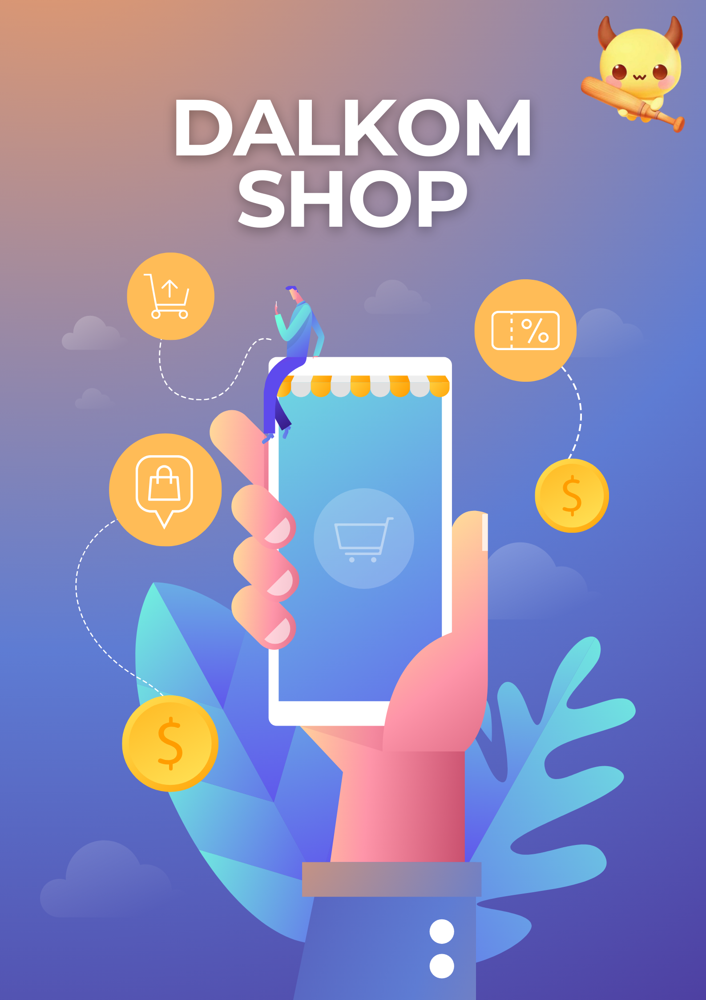

# 달콤한 복지, 임직원 전용 쇼핑몰 🍭DalKom.shop

    

 
 

# 프로젝트 소개

## **DALKOM-SHOP**

### **달콤한-혜택과-편안한-쇼핑공간**

DALKOM SHOP은 다음카카오(DKT)의 사내 몰로,
’달콤하다’와 ‘다음카카오’를 연상시켜 '달콤샵'으로 명명되었습니다.
이 이름은 ‘달다’는 의미뿐만 아니라 편안하고 포근하다는 감정을 담아,
우리의 사내 몰이 사원들에게 편안하고 포근한 공간으로 기억되길 바라는 마음을 반영합니다.

- **프로젝트 취지**
    - '달콤하다'라는 표현에는 달다는 뿐만 아니라 편안하고 포근하다는 의미도 포함되어 있습니다.
    - 이러한 감정을 사내몰 경험에 녹여내어, DKT 임직원들에게 달콤한 디저트처럼 다양한 혜택을 제공하고자 합니다.
- **프로젝트 내용**
    - DALKOM SHOP은 DKT 사내 직원들을 위한 전용 사내 몰입니다.
    - 회사 내부에서만 접근 가능하며, 각 직원은 개인 계정으로 로그인하여 혜택 및 제품 구매가 가능합니다.
    - 사내몰은 회사의 구매 정책에 따라 운영되며, 재고 관리, 결제 프로세스, 사용 권한 제어 등이 체계적으로 구축되어 있습니다.
    - 회사에서 제공하는 마일리지를 활용하여 다양한 상품 및 혜택을 사내몰에서 이용할 수 있습니다.
- **프로젝트 목표**
    - DALKOM SHOP은 다양한 디저트처럼 다채로운 복지 혜택을 제공하여, 임직원들에게 편안하고 달콤한 경험을 선사합니다.
    - 이를 통해 조직 내 화합과 만족도를 증진시키며, 사내몰을 더욱 즐거운 쇼핑 공간으로 만들어 나갈 것입니다.

 
 

# 팀 소개

## **DoKebi**

- 한국을 대표하는 요괴인 '**도깨비**'와 한국을 대표하는 브랜드인 '**다음카카오**'를 연관 지어 '**DoKebi**'로 표현했습니다.
- 사내 쇼핑몰 프로젝트 담당 팀으로서, **복지 포인트**를 이용하여 직원들에게 **나눠주는** 서비스를 제공하고자 합니다.
- 이는 도깨비가 **보물을 가져다주는 모습**과 더불어, 직원들에게 **특별한 혜택과 기쁨을 전달**하는 역할을 한다는 의미에서 더욱 의미를 부여한 이름입니다.
- **팀 구성**

    | 팀원 |   이름 |         분야 |        닉네임 |                    이메일 |
    | --- | --- | --- | --- | --- |
    | 1 | 김동현 | Cloud, ML, MLOps | adrik | eastlighting1@gachon.ac.kr |
    | 2 | 김민수 | Front, Back | ethan | ms987796@gachon.ac.kr |
    | 3 | 김민준 | Cloud, DevOps | ocean | jmk7117@naver.com |
    | 4 | 김성준 | Cloud, DevOps | jason | kis07150@naver.com |
    | 5 | 김주혜 | Front | betty | mailto:epnjh0807@gachon.ac.kr |
    | 6 | 김지오 | Back | jio | xornjswldh@gachon.ac.kr |
    | 7 | 류창민 | Back | teddy | fbckdals99@gmail.com |
    | 8 | 백현정 | Back, ML | ava | hmuy913@naver.com |
    | 9 | 최다정 | Back | diana | hers010801@gmail.com |
    | 10 | 황수하 | Back | sean | hp980724@gmail.com |

 
 

# Backend 개발 환경

- 버전 및 이슈 관리 : Github, Github Issues, Github Project
- 협업 툴 : slack , jira , notion
- 디자인 : figma
- 커밋 컨벤션 : [Commit Convention](https://www.notion.so/Commit-Convention-113c071302f94e0c84acec95fa06e5f6?pvs=21)
- 브랜치 컨벤션 :  [Branch Convention](https://www.notion.so/Branch-Convention-65c405f9b06948c2ac4fe85d41ef0823?pvs=21)
- 백엔드 코드
  컨벤션 :  [Back-end Code Convention](https://www.notion.so/Back-end-Code-Convention-dd8027fccf8f489a9355393353b28658?pvs=21)
